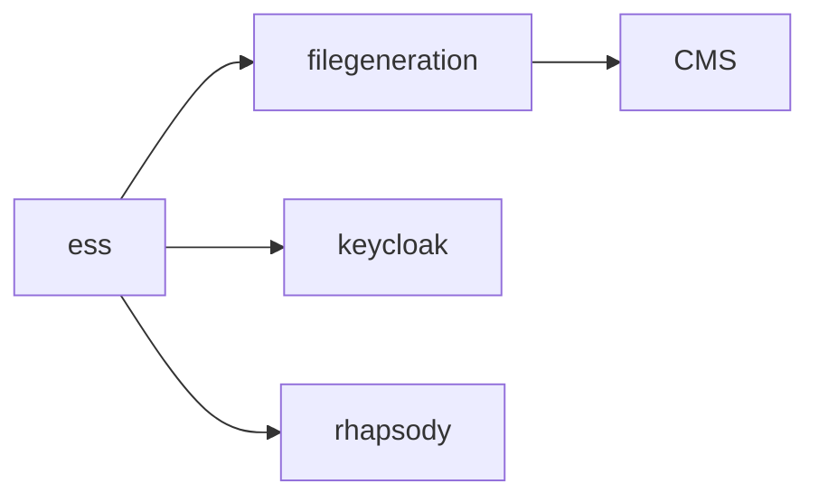

You are given a JSON object that represents service dependencies in a system.

Rules:
- Each key is a service.
- Each value is a list of services it depends on (outgoing calls).
- Convert this structure into a Mermaid dependency graph.
- Use Mermaid "graph LR".
- Draw edges from the calling service to the dependency.
- The output must be valid Markdown containing a Mermaid code block.

Example JSON:
{
  "filegeneration": [
    "CMS"
  ],
  "ess": [
    "filegeneration",
    "keycloak",
    "rhapsody"
  ]
}

Expected output format:

Now generate the Mermaid diagram for the provided JSON.

Return ONLY the generated doc path. Do not include explanations.